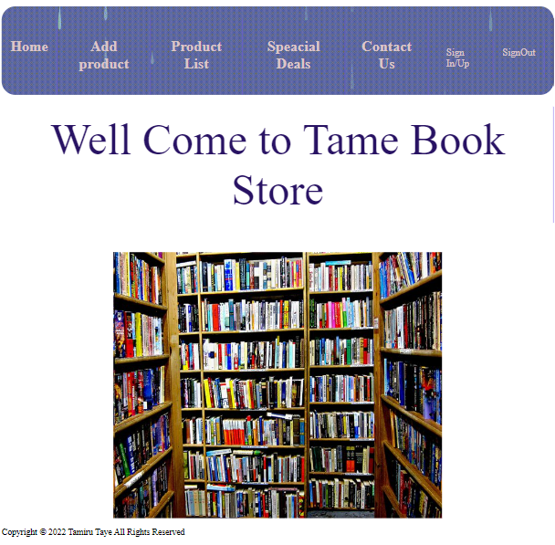
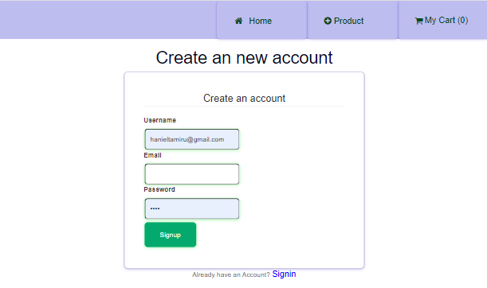
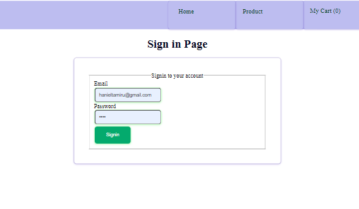
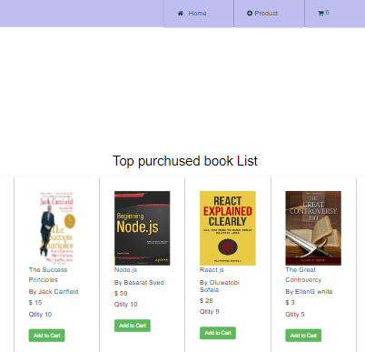
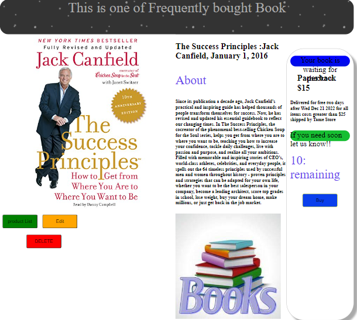
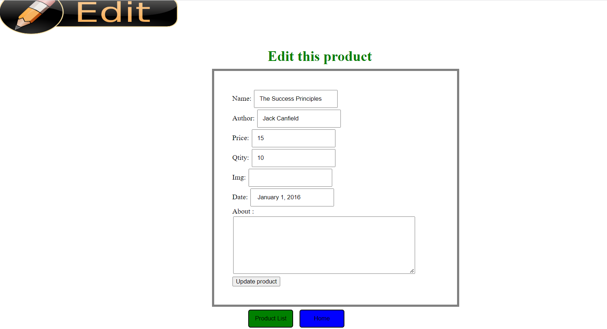

# Book-Store

### By: Tamiru taye

## Objective 

As we know this time everything is becomming online and this is why Software engineeres are needed in all places. Marketing is also one of the the most sector that we use everything online. The purpose of this app is also providing the collection of books needed with their small introduction, Author and price so that everyone need can buy without going anywhere.

## Requirements
    ->Minimum Viable Product Your App Must Posess All 7 RESTful Routes (GET Index/GET New/GET edit/GET create/GETshow/post/Delete)
    ->In the Index page all products will be displayed. There is an image of each book that has a link to show page. There is button links to new product
    ->In show page we have three links(buttons) to back to home, edit page and delete product. There is also Buy button that has linked to quantity of product. When we buy the total quantity will decrease by one.
    ->The create route should redirect to the index. The delete route should redirect to the index. The update route will redirect back to the product's show page

### Details of the app 

When you open this app the main page i said Home will be displayed. It included well come message for users. Users can use nav bars at the top to go anwhere in this website. You can go to New product page, Index page(Product List), signup and signout page. But the formal way is if the client want to buy some books it is good if he.she start by registering. 

The Signup page has a registration form. It asks Username, email and password to signup. Then it checks if the account is pre existing. If there is no name registered buy this ID the account will be created, otherwise the user will be adviced to login using his/her account. From this page we can go to home page or new product list. The signin link is also at the bottom of the form if the user is existing. 

The signin button under registration form takes you to signin page. It asks for Email and password to signin. If evrything is fine the user will be leaded to Index page where he/she can view all products/books available. 

Once you navigate to the Index page (Menu Page) you can then view the list of different books in the Store. At the top of the page there buttons send you back to home and new product page. Every book on this page has image, title ot the book, Author's name, price and quantity available in stock. When the book is ceased from stock the price and quantity will disappeared and we will see the message says Out of stoke.  You can click each book image in the list to then be navigated to the Show page. 

After you click on each book listed on the Index page you will be directed to the Show page. Which highlights each of the book in detail with a speicifc picture ,title of the book with its Author and published date,  basic introduction maximum of one paragraph, the price, and the quantity remained in stock, which when reached 0 will display Out Of Stock. You also have the Buy button which allows you to purchase that any book, as you click the buy button the in stock amount will decrease by one, when reached zero as previously stated the Out of stock message will display and the buy button will dissapear. You also have the option to Edit book lists, Return to Index page, and delete specific book if neccessary. 

The Edit Chai button allows user to edit the current item properties if needed. The user can edit anything on the existing book item whether it be the Name, Picture, About, Price, Author or Publication date. This page hase Update product button by which the edited properties will be saved in database. It also features the product list(book list) and Home button which lead you back to the Index page or the home page. 

### Youtube link 

### Github link 

## Technologies Used
I used Express js to develop app. The view engine used is jsx. In addition to this i used different technologies in this project. These are:-
    ->Node js (for dependencies and middlewares)
    ->CSS  (for style)
    ->VSCode and chrome Dev tool
    ->MongoDB
    ->Mongoose
    ->Github

## Sources 

These are all the resources I used to help me create this project. 

- [w3Schools](https://www.w3schools.com/default.asp)
- [MDN](https://developer.mozilla.org/en-US/)
- [Bootstrap](https://getbootstrap.com/docs/4.0/components/navbar/)
- [fontawesome](https://fontawesome.com/v4/)
